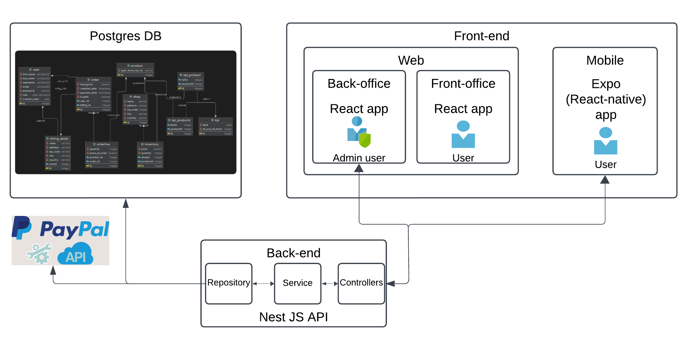

# Documentation Choix technologiques

Pour la réalisation du projet Trinity, nous avons souhaité utiliser des technologies robustes, dotées d’une bonne documentation, et écrites en TypeScript pour avoir à la fois un langage robuste et que chacun des 5 membres de l'équipe puisse être efficace rapidement sans avoir à apprendre un nouveau langage.

## API

Nous avons choisi [NestJS](https://nestjs.com/) pour notre API, il s'agit d'un framework Node.js production-ready qui apporte plus de cadre et de rigueur qu’Express. Sa meilleure scalabilité est un plus pour un projet e-commerce. C’est également un framework dont les concepts sont très similaires à ceux de Spring Boot (annotations/décorateurs, OOP, injection de dépendance, architecture n-tiers), framework Java connu par plusieurs membres de l'équipe. NestJS représente donc pour nous le meilleur compromis entre efficacité, bonnes pratiques et rapidité d’adoption par l’ensemble de l'équipe.

## App mobile

[React Native](https://reactnative.dev/) avec [Expo](https://expo.dev/) pour le mobile. La majeure partie de l'équipe étant familière avec React et NextJS, il nous a été tout naturel d’utiliser un meta-framework comme Expo, qui facilite de multiples procédés, notamment la gestion de l’appareil photo dont nous avons besoin pour la fonctionnalité de scan de code-barres. De plus utiliser React Native nous permet d’avoir une seule code base pour Android et iOS, nous faisant ainsi gagner du temps de développement.

## App web

[React](https://react.dev/) pour le web pour les avantages du client side rendering pour l'UX (mises à jour partielles de l'UI sans avoir à recharger toute la page), et pour bénéficier de son écosystème (NextJS, ReactQuery, ShadcnUI, ...) qui nous permet une bonne efficacité de développement vis-à-vis de la configuration, de la gestion des données et de l'interface utilisateur.

Pour illustrer cela, se réferer au schéma d'architecure ci-dessous :

